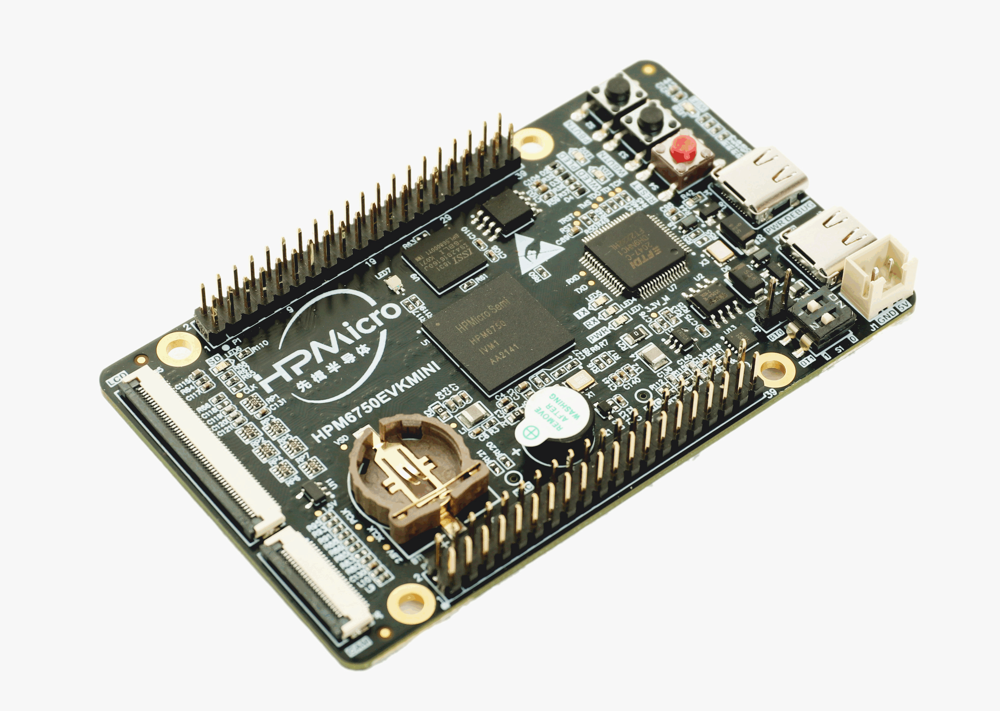

# HPM6750EVKMINI

## Overview

The HPM6750 is a dual-core flashless MCU running 816Mhz. It has a 2MB continuous on-chip ram. Also, it provides various memory interfaces, including SDRAM, Quad SPI NOR Flash, SD/eMMC. It integrates rich audio and video interfaces, including LCD, pixel DMA, camera， and I2S audio interfaces.

 

## Hardware

- HPM6750IVM MCU (816Mhz, 2MB OCRAM)
- Onboard Memory
  - 128Mb SDRAM
  - 64Mb Quad SPI NOR Flash
- Display & Camera
  - LCD connector
  - Camera (DVP)
- WiFi
  - RW007 over SPI
- USB
  - USB type C (USB 2.0 OTG) connector x2
- Audio
  - Mic
  - DAO
- Others
  - TF Slot
  - FT2232
  - Beeper
  - RGB LED
- Expansion port
  - ART-PI extension port

## DIP Switch S1

- Bit 1 and 2 controls boot mode

| bit[2:1] | Description                  |
| -------- | ---------------------------- |
| OFF, OFF | Boot from Quad SPI NOR flash |
| OFF, ON  | Serial boot                  |
| ON, OFF  | ISP                          |

(lab_hpm6750_evkmini_board)=

## Button

(lab_hpm6750_evkmini_board_buttons)=

| Name       | FUNCTIONS                                      |
| ---------- | ---------------------------------------------- |
| PBUTN (S2) | Power Button, TinyUF2 Boot Button, GPIO Button |
| WBUTN (S3) | WAKE UP Button                                 |
| RESET (S4) | Reset Button                                   |

## Pin Description

- SPI Pin

| Function  | Position |
| --------- | -------- |
| SPI2.CSN  | P1[24]   |
| SPI2.SCLK | P1[23]   |
| SPI2.MISO | P1[21]   |
| SPI2.MOSI | P1[19]   |

- I2C Pin：

| Function | Position |
| -------- | -------- |
| I2C0.SCL | P1[13]   |
| I2C0.SDA | P1[15]   |

- UART for core1 debug console：

| Function   | Position |
| ---------- | -------- |
| UART13.TXD | P1[8]    |
| UART13.RXD | P1[10]   |

- ACMP Pin

| Function   | Position |
| ---------- | -------- |
| CMP.INN6   | P2[11]   |
| CMP.COMP_1 | P1[7]    |

- GPTMR Pin

| Function      | Position |
| ------------- | -------- |
| GPTMR2.CAPT_2 | P2[15]   |
| GPTMR2.COMP_0 | P2[19]   |
| GPTMR2.COMP_1 | P2[22]   |

- ADC12 Pin

| Function                         | Position |
| -------------------------------- | -------- |
| ADC12 Reference Voltage Setting | N/A      |
| ADC0/1/2.VINP7                   | P2[11]   |
| ADC0/1/2.VINP8                   | P2[13]   |
| ADC0/1/2.VINP9                   | P2[15]   |
| ADC0/1/2.VINP10                  | P2[16]   |

- ADC16 Pin

| Function                         | Position |
| -------------------------------- | -------- |
| ADC16 Reference Voltage Setting | N/A      |
| ADC3.INA2                        | P1[16]   |

- PWM Pin

| Function | Position |
| -------- | -------- |
| PWM0.P4  | P1[29]   |
| PWM0.P5  | P1[32]   |

- DAO interface

| Function | Position |
| -------- | -------- |
| Speaker  | J2       |

- I2S pin

| Function  | Position |
| --------- | -------- |
| I2S0.FCLK | P1[35]   |
| I2S0.BCLK | P1[12]   |
| I2S0.RXD1 | P1[38]   |
| I2S0.TXD1 | P1[40]   |
| GND       | P1[39]   |

- Ethernet PPS Pin

| Function    | Position |
| ----------- | -------- |
| ENET0.EVTO0 | P1[38]   |
| ENET0.EVTO1 | P1[12]   |
| ENET0.EVTO2 | P1[35]   |

- UART pin for uart_software_rx_idle sample or uart_rx_timeout sample

| Function   | Position |
| ---------- | ------ |
| UART7.TXD | P2[31] |
| UART7.RXD | P2[32] |

- TRGMUX pin for uart_software_rx_idle sample

| Function   | Position |
| ---------- | -------- |
| TRGM2_P9(PD19)  | P2[35]   |

- Motor Pin:

 Refer to section [HPM6750EVKMINI-TO-MOTOR Extension Board ](lab_board_hpm6750evkmini-to-motor-220530RevA) for configuration

## Known Issues

- Some samples may enter the trap handler during runtime, with a MCAUSE == 2 (instruction error). This is due to a flaw in ILM, as detailed in the Errata Manual E00001.

  - Solution: Change the ILM interface address in the link script to ILM_ SLV address.
