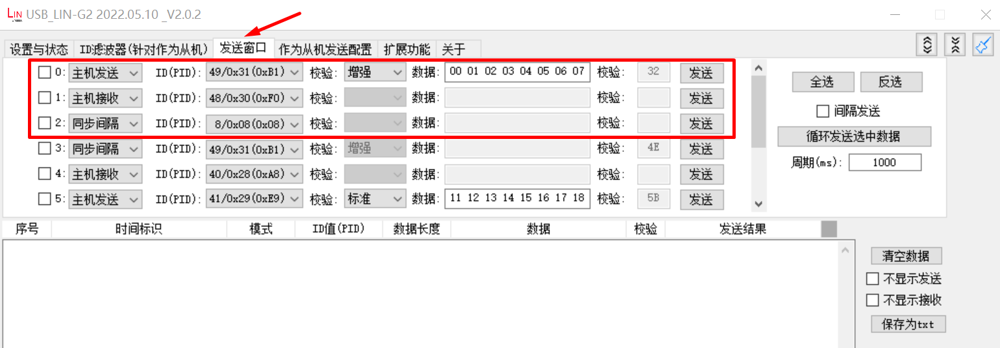

# uart_lin_slave
## Overview

This project demonstrates the functionality of UART simulation LIN salve.

## Note
- The interval between data frames should be greater than or equal to the transmission time of 4 UART bytes.
- The baudrate adaptation function is not supported, need to configured UART baudrate to the desired value.

## Board Setting

Requires a LIN transceiver and USB_LIN debugger
Please refer to [Pin Description](lab_board_resource) for specific board.
connect LIN transceiver mcu signal to UART's TX and RX on board, connect LIN transceiver LIN signal to USB_LIN debugger.

## Running the example

configure usb_lin debugger:
- configure com and baudrate, then click `Set to Debugger` option
  
- Configure sent data, including master sent, master receive and sync break, the sync break could wake up slave from sleep mode：
  
- Running the example, check the result in debugger window
  

When the example runs successfully, the log would be seen on the terminal like:
```console
Test uart lin salve example
uart lin receive ID: 0x30
uart send 8 data:
0x7 0x6 0x5 0x4 0x3 0x2 0x1 0x0
uart lin receive ID: 0x31
uart receive 8 data:
0x0 0x1 0x2 0x3 0x4 0x5 0x6 0x7
```
