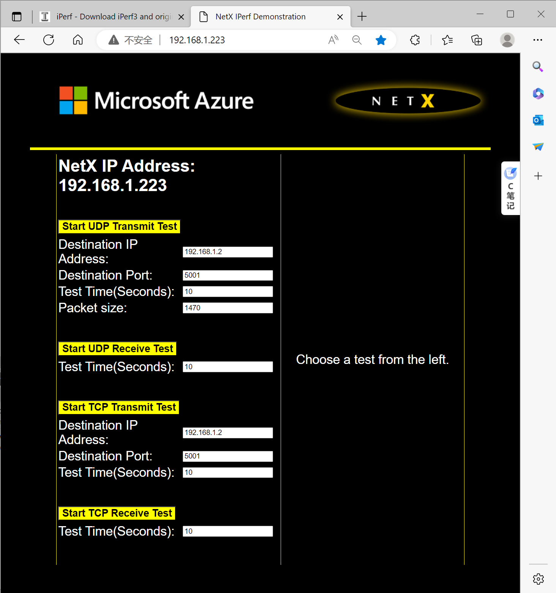

# TCP/UDP 吞吐率测试

## 概述

本示例通过iperf (https://iperf.fr/iperf-download.php) 测试TCP/UDP吞吐性能，共有如下四种模式：

- MCU用作TCP服务端 / PC用作TCP客户端
- MCU用作TCP客户端 / PC用作TCP服务端
- MCU用作UDP服务端 / PC用作UDP客户端
- MCU用作UDP客户端 / PC用作UDP服务端

## 硬件设置

* 使用USB Type-C线缆连接PC USB端口和PWR DEBUG端口
* 使用以太网线缆连接PC以太网端口和开发板RGMII或RMII端口

## 工程配置
- 可以通过将`CONFIG_NETX_ENABLE_DHCP`设置为0或者注释掉定义`CONFIG_NETX_ENABLE_DHCP`宏的语句来禁止DHCP功能。
- 禁用DHCP时，可以注释掉`set(CONFIG_AZURE_RTOS_NETXDUO_ADDONS_DHCP 1)`语句，从而减少工程的源文件数量
- 在文件`CMakeLists.txt`中,  根据开发板原理图，设置匹配的以太网PHY类型，例如："set(CONFIG_ENET_PHY_DP83848 1)"

## 运行示例

* 编译下载程序
* 待Link状态为Up后，使用浏览器访问网址http://192.168.1.223 (和demo中的配置相关，如启用了DHCP功能，请将地址替换为实际申请到的ip地址)，会打开如下iperf测试页面：

* 使用pc端的iperf工具和web页面进行测试。(使用iperf命令行、jperf等gui工具均可)。注意：不支持iperf3。